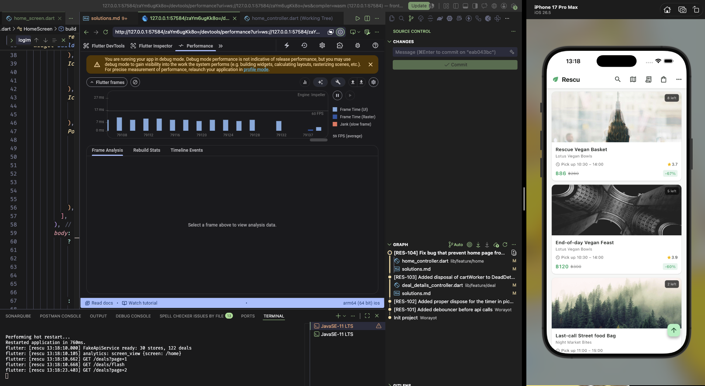
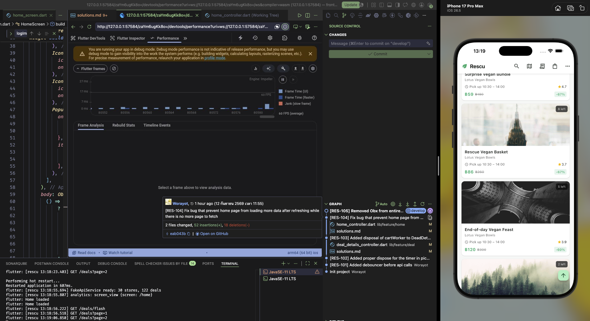

# Rescu — Solution

For AI tool, I used free tier chatGPT from chatgpt.com for this project.

## Part A — Bug tickets

### RES-101 · Search shows results for the wrong query

#### Problem

Type a word quickly in search — for example "sushi", letter by letter.
Frequently the final results do not match what is in the text box: correct
results appear briefly, then get replaced by results for an earlier, shorter
query. Team reproduces this most attempts. Users report "search is drunk".

#### Root cause

Function ```Future<void> _search(String query)``` in lib/feature/search/search_deals_controller.dart returns the query with the slowest response time, caused by multiple async searches at the same time.

#### Solution

This can be fixed with adding a string variable `lastQuery` and compare if the current query and lastQuery is the same, it will trigger api call, otherwise it will not, which will ignore response if a newer search has happened.

But with this implementation, every time a character entered in the search bar, it triggers an api fetch which might not be intended and causes the root cause stated above, adding debouncer will avoid all of those problems.

### RES-102 · Crash after leaving My orders

#### Problem

Open **My orders** while there is an order with an upcoming pickup, then
navigate back. Within a couple of seconds the app crashes in debug builds with
`setState() called after dispose()`.

#### Root cause

Timer.periodic continues running independently of the widget's lifecycle. If the timer isn't cancelled when the widget is disposed, its callback can continue firing and attempt to call setState() after the widget has been disposed.

#### Solution

Store the Timer instance in a variable so it can be cancelled in the dispose() method. `if (mounted)` prevents the setState() called after dispose() exception, while `timer.cancel()` properly stops the timer from continuing to fire.

### RES-103 · Requests pile up the longer you browse

#### Problem

After opening several deal pages, every tap on "Add to bag" triggers a burst
of `GET /deals/:id` requests — one for _each deal viewed earlier in the
session_, even for screens that were closed long ago. The app gets slower
and chattier the longer the session. Watch the console logs while browsing
to see it (every simulated request is logged).

#### Root cause

Each DealDetailsController registers an ever() listener on cartService.items in onInit(). The listener remains active as long as the controller exists.

When navigating away from a deal details screen, the controller was not being disposed, so its ever() listener continued listening to cart changes even though the screen had already been closed.

As more deal pages were opened, more controllers and listeners accumulated. Consequently, adding a deal to the cart triggered _recheckAvailability() for every previously viewed deal, resulting in a burst of GET /deals/:id requests and causing the app to become slower and more network-intensive over time.

#### Solution

Ensure the ever() worker is disposed when the DealDetailsController is disposed.

Store the worker returned by ever() and dispose of it in onClose():

```dart
late final Worker _cartWorker;

@override
void onInit() {
  super.onInit();

  deal = Get.arguments as DealModel;
  _quantityLeft.value = deal.quantityLeft;

  _cartWorker = ever(cartService.items, (_) => _recheckAvailability());
}

@override
void onClose() {
  _cartWorker.dispose();
  super.onClose();
}
```

This ensures that each deal details controller stops listening to cart changes when it is no longer needed.

### RES-104 · Duplicate deals in the home feed

#### Problem

Scroll to the bottom of the home feed so the next page starts loading, then
quickly pull down to refresh while it is still loading. Intermittently the
feed ends up with duplicated cards, or more items than the catalog contains.

#### Root cause

refreshDeals() and loadMore() can execute concurrently. If a pagination request is still loading when the user pulls to refresh, the refresh resets _page and replaces the feed while the older loadMore() request is still in flight.

When the older pagination request completes, it can append its stale page of results to the newly refreshed feed. This race condition can result in duplicated cards or more items than the catalog contains.

#### Solution

Track the state of each feed request and ignore pagination responses that were started before a refresh.

Also calculate the next page in a local variable and update _page only after the request succeeds. This prevents an in-flight request from modifying the current pagination state after a refresh has reset it.

### RES-105 · Home feed is janky and memory keeps climbing

#### Problem

On mid-range Android devices the home feed drops frames noticeably while
scrolling, and memory grows the further you scroll until the OS kills the app.
DevTools shows the entire feed rebuilding continuously during scroll, and the
image cache ballooning. There is more than one contributing cause — we expect
you to find and explain them, with before/after evidence from DevTools
(screenshots or numbers in `solutions.md`).

#### Root cause

- scrollOffset was observed by a top-level Obx, causing the entire Home screen to rebuild on every scroll event.
- Deal cards were eagerly built instead of using lazy list construction.
- Image cache growth was investigated separately using DevTools.

#### Solution

- Reduced the Obx scope so scrollOffset only rebuilds the AppBar and FAB.
- Changed the deal feed to ListView.builder for lazy construction.
- Compared memory and frame performance before and after the changes.

The Home feed now avoids rebuilding the entire screen during scrolling and only builds deal cards as needed. DevTools shows improved scrolling performance and reduced unnecessary work.

##### Before fix



##### After fix



### RES-106 · Wrong pickup times; "Pickup today" filter misses deals

#### Problem

Multiple user complaints: a bakery that opens **06:00–09:30** shows
"Pick up 23:00 – 02:30" on its cards, and several stores with pickup slots
today never appear when the **Pickup today** filter is on. Some users showed
up at closed stores. The backend team insists their data is correct and
points out the API sends standard ISO-8601 UTC instants, like every API we
integrate with.

#### Root cause

The API sends pickup times as UTC ISO-8601 instants. DateTime.parse() preserves the UTC timezone when parsing values such as 2026-09-12T23:00:00Z.

The model was using these UTC values directly for:

Displaying the pickup time.
Checking whether the pickup starts today.
Checking the current pickup availability.

As a result, the UI compared and displayed UTC times instead of the user's local time.

Additionally, isToday only compared the day number, which could incorrectly match dates from different months or years.

#### Solution

Convert the API timestamps to local time when creating the model:

```dart
start: DateTime.parse(json['start'] as String? ?? '').toLocal(),
end: DateTime.parse(json['end'] as String? ?? '').toLocal(),
```

Update isToday to compare the complete local date:

```dart
bool get isToday {
  final now = DateTime.now();

  return start.year == now.year &&
      start.month == now.month &&
      start.day == now.day;
}
```

isOpenNow can continue using the local DateTime values:

```dart
bool get isOpenNow {
  final now = DateTime.now();

  return now.isAfter(start) && now.isBefore(end);
}
```

### RES-107 · Deep link opens to a crash

#### Problem

Marketing sends push notifications that deep-link to deals, e.g.
`rescu://open/deal?id=42&source=push`. Opening such a link crashes with
`type 'Null' is not a subtype of type 'DealModel'`. Opening the same deal
from the home feed works fine.

Requirement: the link must land the user on a fully working deal page (deal
42 exists in the catalog). Showing an error/fallback screen instead is not an
acceptable resolution for this ticket.

#### Root cause

The deal details screen expected a DealModel to be provided through Get.arguments:

deal = Get.arguments as DealModel;

Home navigation passes the DealModel, so this works.

However, the deep link only provides the deal ID:

id=42

It does not provide a DealModel, causing Get.arguments to be null and the cast to fail.

#### Solution

Check Get.arguments for an existing DealModel.
If a DealModel is provided from the Home page, use it directly without fetching the deal again.
If no DealModel is provided, treat the navigation as a deep link.
Extract the id parameter from the deep link.
Fetch the deal using dealRepo.fetchById(dealId).
Store the loaded DealModel in the controller.
Show a loading state while a deep-linked deal is being fetched.
Build the normal deal details page after the deal has loaded.
Dispose the cart worker when the details controller is closed to prevent closed deal pages from continuing to trigger availability requests.

The deal details page can therefore be opened from either the Home page or a deep link while avoiding an unnecessary initial fetch when the DealModel is already available

## Part B — Features

### F-1 · Live flash-sale countdowns

Flash deals (`flashSaleEndsAt` on the model) currently show a static
"Ends soon" badge. Replace it with a **live countdown** (`mm:ss`, or
`hh:mm:ss` above an hour) everywhere the deal appears: flash rail, home feed
cards, and the details screen.

Requirements:

- When a countdown reaches zero: the card switches to a disabled "Expired"
  state, the deal can no longer be added to the bag, and if it is already in
  the bag it is removed with a visible notice.
- The home feed must stay smooth with 100+ visible countdowns. We will
  profile your implementation with DevTools; per-second rebuilds must be
  scoped to the text that actually changes — not whole cards, not the whole
  list.

#### F-1 Implementation

Replaced the static "Ends soon" badge with a live countdown based on DealModel.flashSaleEndsAt.

A single Timer.periodic is owned by HomeController for the home feed. It updates a reactive flashDealTick once per second. Individual countdown widgets listen to this tick and calculate their own remaining time from flashSaleEndsAt.

This keeps the timer logic centralized instead of creating one periodic timer per deal.

HomeController
    └── Timer.periodic(1 second)
            └── flashDealTick

FlashDealCountdown
    └── Obx
          └── recalculates remaining time

The countdown displays:

mm:ss when less than one hour remains
hh:mm:ss when one hour or more remains
00:00 when the sale has expired

Only the countdown Text is reactive. The card, list, and surrounding Home screen are not rebuilt every second.

When a flash sale expires, the controller removes the expired deal from the flash-deal list. This causes the flash section to update only when the list actually changes.

For the details screen, the countdown starts after the deal has been loaded. This is important for deep links because the deal is initially unavailable until fetchById() completes.

The details screen also maintains a reactive expiration state so canAddToBag immediately becomes false when the countdown reaches zero.

If an expired deal is already in the cart:

The countdown detects expiration.
The cart is checked for that deal.
The deal is removed.
A visible snackbar informs the user that the expired deal was removed.

The expiration timestamp remains the source of truth; the countdown is only the UI representation of that timestamp.

Bug: Expired flash deals are still shown in home feed.

### F-2 · Impression tracking

Product wants view analytics on deal cards. Using `AnalyticsService`:

- Log a `deal_impression` event when a deal card has been **≥50% visible for
  at least 1 continuous second**. Properties: `deal_id`, `source`
  (`home_feed`, `flash_rail`, or `search`), `position` (index in its list).
- At most **once per deal per app session**, across all screens.
- Do not send events one by one: batch them and deliver via
  `FakeApiService.sendAnalyticsBatch` when either 10 events have accumulated
  or 15 seconds have passed since the first unsent event — whichever comes
  first.
- Scrolling performance must not regress.
- The `visibility_detector` package is already in `pubspec.yaml`; using it is
  allowed but not required.

#### F-2 Implementation

Impression tracking is implemented using three responsibilities:

Deal cards
    ↓
visibility qualification

AnalyticsImpressionService
    ↓
session-level deduplication

AnalyticsBatchService
    ↓
event batching and delivery
Visibility qualification

DealCard and FlashDealCard use VisibilityDetector to determine how much of the card is visible.

When the card reaches at least 50% visibility, a one-shot 1-second timer starts.

If visibility falls below 50% before the timer completes, the timer is cancelled.

Therefore, the impression is only recorded when the card remains continuously visible for the required duration.

< 50%
  ↓
no timer

>= 50%
  ↓
start 1-second timer
  ↓
still >= 50%
  ↓
record impression

The visibility callback performs only lightweight timer/state operations. It does not perform network requests or trigger widget rebuilds.

### F-3 · Stock reservations with optimistic UI

Right now the bag is purely local, so two users can "add" the last bag and
one of them finds out only at pickup. The backend already exposes
reservations (see `FakeApiService.reserveDeal` / `releaseReservation`, and
`reservationId` on checkout): a reservation holds stock for **5 minutes** and
intermittently fails with a 409 when stock is contended.

Build reservation support into the bag:

- Adding to the bag reserves stock. The UI must respond **optimistically**
  (instant feedback), then reconcile: if the reservation fails, the item is
  rolled back out of the bag with a clear, non-technical message.
- Each bag line shows how long its reservation has left.
- Removing a line (or reducing quantity) releases/adjusts the hold.
- Checkout passes reservation ids; handle the `410 reservation expired`
  rejection gracefully.
- **Deliberately underspecified:** what should happen when a reservation
  expires while the user is still in the app (or mid-checkout)? Decide the
  product behaviour yourself, implement it, and justify the decision in
  `solutions.md`. There is no single right answer — there are wrong ones.

_ReservationStatus(...)

If the error comes back, we've isolated it to _ReservationStatus and its reactive rebuild rather than the Column itself.

So I wouldn't conclude that Column is inherently the problem. More likely, the Column creates the layout boundary in which the changing _ReservationStatus exposes the issue.

#### F-2 Implementation

Impression tracking is implemented using three responsibilities:

Deal cards

↓

visibility qualification

AnalyticsImpressionService

↓

session-level deduplication

AnalyticsBatchService

↓

event batching and delivery

Visibility qualification

DealCard and FlashDealCard use VisibilityDetector to determine how much of the card is visible.

When the card reaches at least 50% visibility, a one-shot 1-second timer starts.

If visibility falls below 50% before the timer completes, the timer is cancelled.

Therefore, the impression is only recorded when the card remains continuously visible for the required duration.

< 50%

↓

no timer

>= 50%

↓

start 1-second timer

↓

still >= 50%

↓

record impression

The visibility callback performs only lightweight timer/state operations. It does not perform network requests or trigger widget rebuilds.

### F-3 · Stock reservations with optimistic UI

Right now the bag is purely local, so two users can "add" the last bag and

one of them finds out only at pickup. The backend already exposes

reservations (see `FakeApiService.reserveDeal` / `releaseReservation`, and

`reservationId` on checkout): a reservation holds stock for **5 minutes** and

intermittently fails with a 409 when stock is contended.

Build reservation support into the bag:

- Adding to the bag reserves stock. The UI must respond **optimistically**

(instant feedback), then reconcile: if the reservation fails, the item is

rolled back out of the bag with a clear, non-technical message.

- Each bag line shows how long its reservation has left.

- Removing a line (or reducing quantity) releases/adjusts the hold.

- Checkout passes reservation ids; handle the `410 reservation expired`

rejection gracefully.

- **Deliberately underspecified:** what should happen when a reservation

expires while the user is still in the app (or mid-checkout)? Decide the

product behaviour yourself, implement it, and justify the decision in

`solutions.md`. There is no single right answer — there are wrong ones.

#### F-3 Implementation

#### Reservation expires handling

Stock reservations are implemented by separating cart state, reservation/business logic, and UI state:

Deal details / Cart UI
        ↓
CartController
        ↓
CartService
        ↓
OrderRepo
        ↓
FakeApiService
        ↓
reservation API
Reservation lifecycle

Adding a deal to the bag immediately updates the local cart so the UI responds without waiting for the network request.

The app then attempts to reserve the requested quantity.

Add to bag
    ↓
Add item locally
    ↓
Mark as "reserving"
    ↓
Request reservation
    ↓
┌─────────────────────┐
│ Reservation result  │
└─────────────────────┘
       ↓          ↓
   success      failure
       ↓          ↓
   reserved    rollback
       ↓          ↓
show countdown  remove item

If the reservation succeeds, the returned reservation ID and expiration time are stored on the cart item.

If the reservation fails, the optimistic cart change is rolled back and the user receives a clear, non-technical error message rather than an API error.

##### Reservation countdown

Each reserved cart item displays the remaining reservation time.

Reservations are held for 5 minutes.

A lightweight timer in CartController increments a reactive reservationTick every second. Countdown widgets listen to this value and recalculate the remaining time locally.

The timer does not make a network request every second.

reservationTick++
        ↓
countdown widget rebuilds
        ↓
calculate expiresAt - DateTime.now()
        ↓
display remaining time

When the expiration time is reached, the cart service changes the item's state to expired.

##### Quantity changes

Increasing or decreasing the quantity must keep the server-side reservation consistent with the cart.

Because the backend does not provide a dedicated adjustReservation operation, quantity changes are implemented by releasing the existing reservation and requesting a new reservation for the updated quantity.

Change quantity
      ↓
release existing reservation
      ↓
reserve updated quantity
      ↓
update reservation ID
      ↓
update expiration time

The UI remains responsive during this process and the quantity controls are temporarily disabled while a reservation operation is in progress.

##### Removing an item

When an item with an active reservation is removed:

Remove item
    ↓
remove from local bag
    ↓
release reservation

The local removal happens immediately so the UI responds without waiting for the release request.

Reservation expiration

When a reservation expires while the user is still in the app, the item remains in the bag but is marked as expired.

The user is shown the expired state with two options:

Reservation expired
        ↓
 ┌───────────────┐
 │               │
Reserve again   Remove
 │
 ↓
request new reservation
        ↓
 ┌───────────────┐
 │               │
success        failure
 │               │
 ↓               ↓
reserved       remain expired

An expired item cannot be checked out until a new reservation has been successfully obtained.

This avoids silently removing something the user may still want while ensuring that checkout can never proceed using an expired reservation.

##### Checkout

Checkout only becomes available when all items in the bag have valid reservations.

The checkout request includes the reservation IDs associated with the cart items.

Bag
 ↓
Check all reservations
 ↓
All valid?
 ├── No → Disable checkout
 │
 └── Yes
      ↓
   Checkout
      ↓
reservation IDs sent to backend

If the backend responds with 410 Reservation Expired, the affected reservation state is reconciled with the local cart and checkout is stopped.

The user is then given the opportunity to reserve the item again rather than receiving a technical HTTP error.

##### Optimistic UI and rollback

The implementation deliberately uses optimistic UI for cart operations because waiting for the reservation API before updating the bag would make normal interactions feel unnecessarily slow.

The important distinction is that optimistic UI does not mean assuming the operation will succeed.

User action
    ↓
Update local UI immediately
    ↓
Perform server operation
    ↓
Reconcile result
   ↙       ↘
success   failure
  ↓          ↓
keep       rollback

This provides immediate feedback while still maintaining consistency with the backend.

#### Product decision: expired reservations

The reservation expiration behavior was deliberately chosen because expiration does not necessarily mean that the user no longer wants the deal.

Silently removing an expired item could cause the user to lose an item they intentionally added to the bag. Instead, the item remains visible and clearly indicates that its stock is no longer being held.

The user must explicitly reserve again before checkout can continue.

This provides a balance between preserving user intent and preventing invalid checkout attempts. It also makes the reservation state visible rather than silently changing the contents of the user's bag.

#### F-3 Bug

Reducing quantity of items in the bag will not work in case of api gives 409. This is result from api not having route for quantity adjustment

### Q1

In this codebase, what is the difference between a `GetxController`'s
     lifecycle and a widget `State`'s lifecycle? Name one bug from Part A
     that exists because of confusion between the two.

A GetxController follows GetX's lifecycle (onInit() → onClose()) and can outlive the screen that uses it, while a widget State follows Flutter's lifecycle (initState() → dispose()) and exists only while that widget is mounted.

Part A bug

The problem was the pickup countdown timer by treating a widget's lifecycle as if it were the same as the GetxController's lifecycle.

The countdown was implemented in a widget State using a Timer.periodic that called setState() every second. However, the related GetxController could remain alive after the screen/widget was removed. This caused old controllers and their listeners to continue reacting to cart changes, even though their corresponding UI was no longer visible.

As a result, after opening multiple deal-detail pages, tapping Add to bag could trigger multiple stale deal/stock requests such as GET /deals/:id from previously viewed deal-detail controllers.

The underlying issue was not tying the ongoing work to the correct lifecycle: widget-specific work should stop in State.dispose(), while controller-specific work should stop in GetxController.onClose().

### Q2

When does wrapping a large subtree in a single `Obx` hurt you? How
     do you decide how tightly to scope reactivity?

- Wrapping a large subtree in a single `Obx` and cause entire widget to be rebuilt. I would only wrap `Obx` arround the widgets those will change depend on the state such as text for countdown.

### Q3

How would you write an automated test that would have caught
     RES-106 before release? What (if anything) would you change in the code
     to make such a test possible?

- Timezone handling is tested at the API/model boundary rather than duplicated across individual UI widgets.

Regression tests use representative UTC API timestamps, including timestamps
that cross local midnight, to verify that pickup dates and times are interpreted
according to the application's local-time contract.

Date filtering is tested independently with an injected `now` value so the
tests are deterministic. Cases include:

- UTC timestamps that become "today" after local-time conversion.
- Pickup times that cross UTC midnight.
- Pickup dates from another month with the same day number.
- Pickup dates from another year with the same month/day.
- Pickup windows whose displayed start/end times differ from their raw UTC
  representation.

A widget-level test additionally verifies that the converted pickup window is
actually rendered correctly, providing coverage between the model and UI
layers without requiring every screen that displays a pickup time to duplicate
the same timezone tests.

### Time spent

I spent roughly **5 days** to complete this task. I spent the first days studying GetX which is very new to me considering I prefered Riverpod to than GetX for state management in my previous project.

This project helps me understand GetX and taught me how to use it, it will be very useful for my future Flutter projects.

### What would I do next with one more day

I would spend my time studying GetX more because I am very interested how easy it is to use for routing, navigating, binding, state management, etc. I would also spend my time going through devtools and try to optimize the app.
